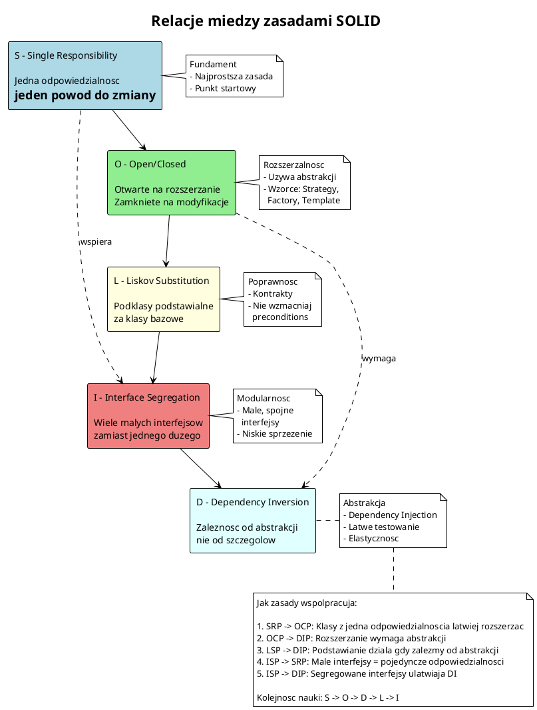

# Test diagramu solid_relationships.puml w przeglądarce

## Instrukcja:

1. Skopiuj poniższy kod
2. Wejdź na: https://www.plantuml.com/plantuml/uml/
3. Wklej kod w edytorze
4. Sprawdź czy diagram się wyświetla

## Kod do skopiowania:

## Oczekiwany rezultat:

Diagram powinien pokazywać:
- 5 kolorowych prostokątów (S, O, L, I, D) ułożonych pionowo
- Strzałki łączące kolejne elementy
- Dodatkowe kropkowane strzałki (SRP->ISP, OCP->DIP)
- Notatki po prawej stronie dla każdej zasady
- Notatka na dole z podsumowaniem

## Jeśli działa:

✅ Diagram ma poprawną składnię PlantUML i można go używać!

## Jeśli nie działa:

❌ Sprawdź komunikat błędu w edytorze online i popraw składnię.

