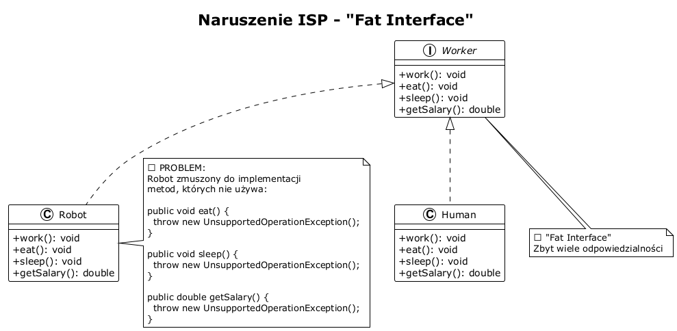
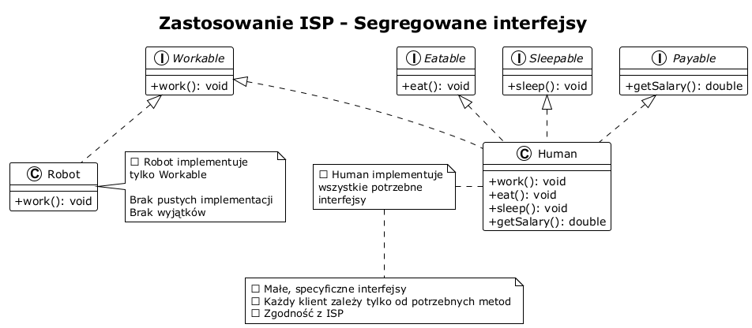
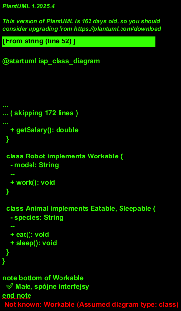

# Interface Segregation Principle (ISP)

## Zasada Segregacji Interfejsów

### Definicja

> "No client should be forced to depend on methods it does not use." - Robert C. Martin

**Interface Segregation Principle** stwierdza, że klienci nie powinni być zmuszani do zależności od interfejsów, których nie używają.

### Wyjaśnienie koncepcji

Zasada ISP oznacza, że:
- **Małe, specyficzne interfejsy** są lepsze niż duże, ogólne
- **Klienci powinni wiedzieć tylko o metodach, których używają**
- **Interfejsy powinny być segregowane** według potrzeb klientów

### Problem - naruszenie ISP

```java
// ❌ "Fat Interface" - zbyt szeroki interfejs
public interface Worker {
    void work();
    void eat();
    void sleep();
    void getSalary();
}

// Robot nie je ani nie śpi!
public class Robot implements Worker {
    @Override
    public void work() { /* OK */ }
    
    @Override
    public void eat() { 
        throw new UnsupportedOperationException(); // ❌
    }
    
    @Override
    public void sleep() { 
        throw new UnsupportedOperationException(); // ❌
    }
    
    @Override
    public void getSalary() { 
        throw new UnsupportedOperationException(); // ❌
    }
}
```



### Rozwiązanie - zastosowanie ISP

```java
// ✅ Małe, specyficzne interfejsy
public interface Workable {
    void work();
}

public interface Eatable {
    void eat();
}

public interface Sleepable {
    void sleep();
}

public interface Payable {
    void getSalary();
}

// Człowiek implementuje wszystkie
public class Human implements Workable, Eatable, Sleepable, Payable {
    @Override public void work() { /* ... */ }
    @Override public void eat() { /* ... */ }
    @Override public void sleep() { /* ... */ }
    @Override public void getSalary() { /* ... */ }
}

// Robot implementuje tylko potrzebne
public class Robot implements Workable {
    @Override public void work() { /* ... */ }
}
```



### Jak uruchomić przykłady

#### Kompilacja i uruchomienie z linii poleceń

**Wersja "before" (naruszenie ISP):**
```powershell
cd C:\home\gitHub\oop-concepts-java\03_ADVANCED\src
javac solid/interface_segregation/before/*.java
# Brak demo w before - tylko definicje interfejsu
```

**Wersja "after" (zgodnie z ISP):**
```powershell
cd C:\home\gitHub\oop-concepts-java\03_ADVANCED\src
javac solid/interface_segregation/after/*.java
java solid.interface_segregation.after.WorkerDemo
```

#### Oczekiwane wyniki

**After (zgodnie z ISP):**
```
=== Praca ===
Human is working
Robot is working efficiently

=== Jedzenie ===
Human is eating

=== Sen ===
Human is sleeping

✅ Robot implementuje tylko Workable
✅ Brak pustych implementacji lub wyjątków
✅ Każdy interfejs jest mały i spójny
```

### Przykłady implementacji

Zobacz kod w plikach:
- [before/Worker.java](before/Worker.java) - Fat Interface
- [after/Workable.java](after/Workable.java) - Segregowane interfejsy
- [after/WorkerDemo.java](after/WorkerDemo.java) - Demonstracja

### Diagram klas



### Korzyści ISP

- ✅ Mniejsze interfejsy = łatwiejsza implementacja
- ✅ Większa elastyczność
- ✅ Łatwiejsze testowanie
- ✅ Lepsza separacja odpowiedzialności
- ✅ Niższe sprzężenie

### Praktyczne przykłady

#### Przykład 1: Urządzenia wielofunkcyjne

```java
// ❌ Naruszenie ISP
interface MultiFunctionDevice {
    void print();
    void scan();
    void fax();
}

// ✅ Zgodne z ISP
interface Printer { void print(); }
interface Scanner { void scan(); }
interface Fax { void fax(); }

class AllInOnePrinter implements Printer, Scanner, Fax { }
class SimplePrinter implements Printer { }
```

#### Przykład 2: Repozytoria

```java
// ❌ Naruszenie ISP
interface Repository<T> {
    T findById(Long id);
    List<T> findAll();
    void save(T entity);
    void delete(T entity);
    void update(T entity);
}

// ✅ Zgodne z ISP
interface ReadRepository<T> {
    T findById(Long id);
    List<T> findAll();
}

interface WriteRepository<T> {
    void save(T entity);
    void delete(T entity);
}
```

### Podsumowanie

| Aspekt | Fat Interface | ISP |
|--------|--------------|-----|
| Rozmiar interfejsu | Duży | Mały |
| Implementacje | Częściowe | Pełne |
| Sprzężenie | Wysokie | Niskie |
| Elastyczność | Niska | Wysoka |

### Kluczowe zasady

1. **Preferuj wiele małych interfejsów**
2. **Segreguj według potrzeb klientów**
3. **Unikaj pustych implementacji**
4. **Używaj kompozycji interfejsów**

### Referencje

- Robert C. Martin, "Agile Software Development: Principles, Patterns, and Practices"

