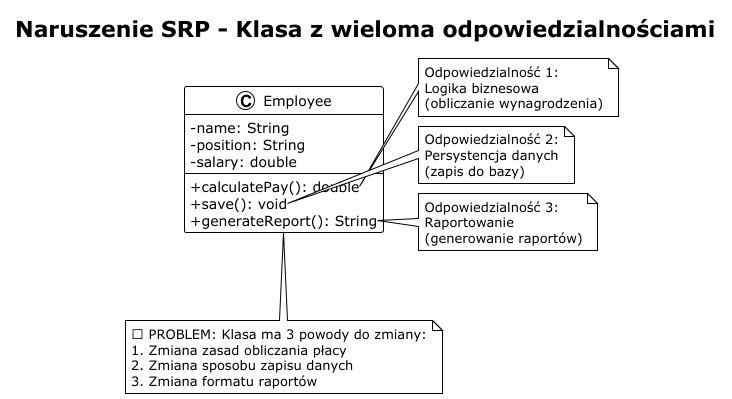
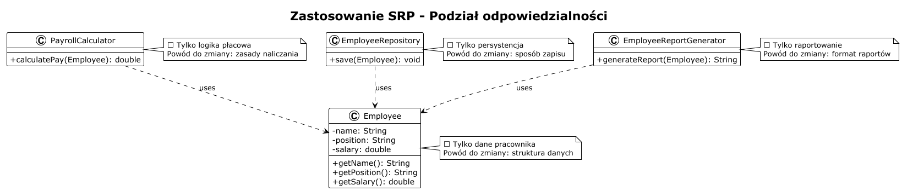
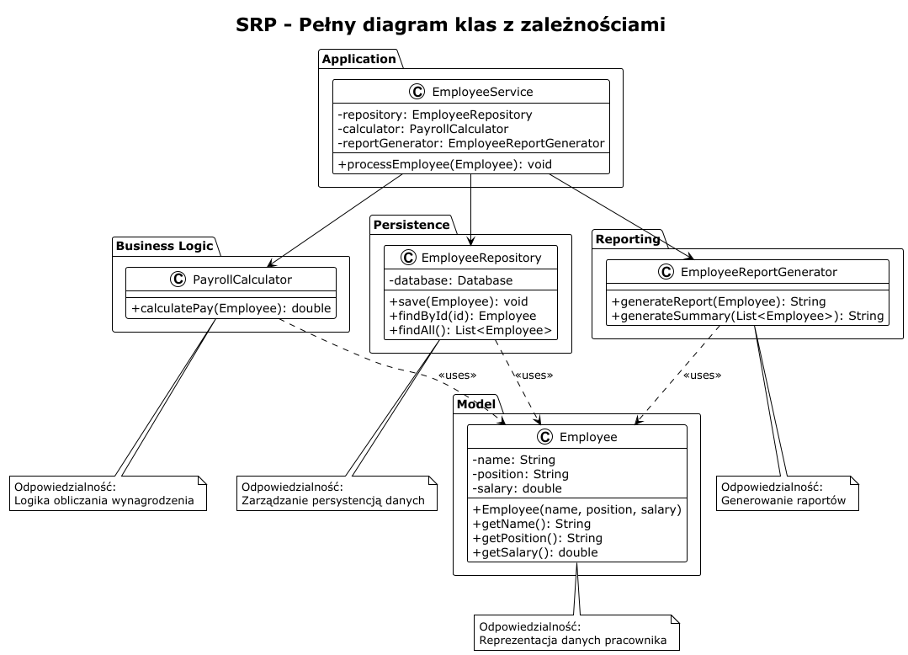

# Single Responsibility Principle (SRP)

## Zasada Pojedynczej Odpowiedzialności

### Definicja

> "A class should have one, and only one, reason to change." - Robert C. Martin

**Single Responsibility Principle** stwierdza, że klasa powinna mieć tylko jeden powód do zmiany, czyli powinna być odpowiedzialna tylko za jeden aspekt funkcjonalności systemu.

### Wyjaśnienie koncepcji

Zasada SRP jest fundamentalną zasadą projektowania obiektowego. Oznacza ona, że każda klasa powinna:
- Mieć **jedną, dobrze zdefiniowaną odpowiedzialność**
- Być **spójna** - wszystkie metody powinny służyć tej samej odpowiedzialności
- Mieć **tylko jeden powód do zmiany** - zmiana wymagań dotycząca danej odpowiedzialności

#### Korzyści stosowania SRP:
- **Łatwiejsze utrzymanie** - mniejsze klasy są prostsze do zrozumienia
- **Wyższa testowalność** - łatwiej przetestować klasę z jedną odpowiedzialnością
- **Lepsze ponowne wykorzystanie** - klasy z jedną odpowiedzialnością są bardziej uniwersalne
- **Mniejsze ryzyko regresji** - zmiana w jednej odpowiedzialności nie wpływa na inne
- **Lepsze separowanie zmian** - różne powody zmian nie kolidują ze sobą

### Problem - naruszenie SRP

Rozważmy klasę `Employee`, która łączy w sobie wiele odpowiedzialności:

```java
public class Employee {
    private String name;
    private String position;
    private double salary;
    
    public double calculatePay() {
        // Logika obliczania wynagrodzenia
        return salary * 1.2;
    }
    
    public void save() {
        // Logika zapisu do bazy danych
        System.out.println("Saving employee to database...");
    }
    
    public String generateReport() {
        // Logika generowania raportu
        return "Employee Report: " + name;
    }
}
```

**Problemy:**
1. **Wiele odpowiedzialności**: logika biznesowa, persystencja, raportowanie
2. **Wiele powodów do zmiany**:
   - Zmiana zasad obliczania wynagrodzenia
   - Zmiana sposobu zapisu danych
   - Zmiana formatu raportów
3. **Trudne testowanie** - wymaga mockowania bazy danych i innych zależności
4. **Niskie ponowne wykorzystanie** - nie można użyć samej logiki obliczania płacy



### Rozwiązanie - zastosowanie SRP

Rozdzielamy odpowiedzialności na osobne klasy:

```java
// Odpowiedzialność: reprezentacja danych pracownika
public class Employee {
    private String name;
    private String position;
    private double salary;
    
    public Employee(String name, String position, double salary) {
        this.name = name;
        this.position = position;
        this.salary = salary;
    }
    
    // Gettery
    public String getName() { return name; }
    public String getPosition() { return position; }
    public double getSalary() { return salary; }
}

// Odpowiedzialność: obliczanie wynagrodzenia
public class PayrollCalculator {
    public double calculatePay(Employee employee) {
        // Logika obliczania wynagrodzenia
        return employee.getSalary() * 1.2;
    }
}

// Odpowiedzialność: persystencja danych
public class EmployeeRepository {
    public void save(Employee employee) {
        // Logika zapisu do bazy danych
        System.out.println("Saving employee: " + employee.getName());
    }
}

// Odpowiedzialność: generowanie raportów
public class EmployeeReportGenerator {
    public String generateReport(Employee employee) {
        // Logika generowania raportu
        return "Employee Report: " + employee.getName() + 
               ", Position: " + employee.getPosition();
    }
}
```

**Korzyści:**
- ✅ Każda klasa ma jedną, jasno zdefiniowaną odpowiedzialność
- ✅ Łatwe testowanie - każda klasa może być testowana niezależnie
- ✅ Elastyczność - można zmienić sposób zapisu bez wpływu na logikę biznesową
- ✅ Ponowne wykorzystanie - `PayrollCalculator` może być użyty w innych kontekstach



### Przykład praktyczny

Zobacz implementację w plikach:
- [before/Employee.java](before/Employee.java) - Naruszenie SRP
- [before/EmployeeDemo.java](before/EmployeeDemo.java) - Demonstracja problemu
- [after/Employee.java](after/Employee.java) - Model danych
- [after/PayrollCalculator.java](after/PayrollCalculator.java) - Logika biznesowa
- [after/EmployeeRepository.java](after/EmployeeRepository.java) - Persystencja
- [after/EmployeeReportGenerator.java](after/EmployeeReportGenerator.java) - Raportowanie
- [after/EmployeeDemo.java](after/EmployeeDemo.java) - Demonstracja rozwiązania

### Diagram klas



### Jak rozpoznać naruszenie SRP?

Pytania pomocnicze:
1. Czy klasa ma więcej niż jeden powód do zmiany?
2. Czy metody w klasie operują na różnych zbiorach danych?
3. Czy klasa ma zależności od wielu różnych modułów?
4. Czy opis klasy zawiera słowa "i" lub "lub"?
5. Czy klasa ma więcej niż 5-7 metod publicznych?

### Pułapki i błędy

❌ **Nadmierne rozdrobnienie** - tworzenie osobnych klas dla każdej metody

```java
// ZŁE - przesadne rozdrobnienie
public class EmployeeNameGetter { }
public class EmployeeNameSetter { }
```

❌ **Zbyt szerokie granice** - klasa dalej ma wiele odpowiedzialności

```java
// ZŁE - dalej zbyt wiele odpowiedzialności
public class EmployeeManager {
    void hire() { }
    void fire() { }
    void calculatePay() { }
    void saveToDatabase() { }
}
```

✅ **Właściwe podejście** - balans między spójnością a rozdrobnieniem

### Podsumowanie

| Aspekt | Przed SRP | Po SRP |
|--------|-----------|---------|
| Liczba odpowiedzialności | 3+ | 1 |
| Łatwość testowania | Niska | Wysoka |
| Ponowne wykorzystanie | Trudne | Łatwe |
| Elastyczność zmian | Niska | Wysoka |
| Ryzyko regresji | Wysokie | Niskie |

### Kluczowe zasady

1. **Jedna odpowiedzialność = jeden powód do zmiany**
2. **Spójność** - wszystkie elementy klasy służą tej samej odpowiedzialności
3. **Separacja** - różne aspekty funkcjonalności w różnych klasach
4. **Balans** - unikaj nadmiernego rozdrobnienia

### Ćwiczenie

Zrefaktoruj klasę `Book`, która naruszuje SRP:

```java
public class Book {
    private String title;
    private String author;
    
    public void printBook() { /* drukowanie */ }
    public void saveToFile() { /* zapis */ }
    public String getBookInfo() { /* informacje */ }
}
```

**Wskazówka**: Zastanów się, ile odpowiedzialności ma ta klasa i jak można je rozdzielić.

### Referencje

- [SOLID Principles (Wikipedia)](https://en.wikipedia.org/wiki/SOLID)
- Robert C. Martin, "Agile Software Development: Principles, Patterns, and Practices"
- Robert C. Martin, "Clean Code: A Handbook of Agile Software Craftsmanship"


